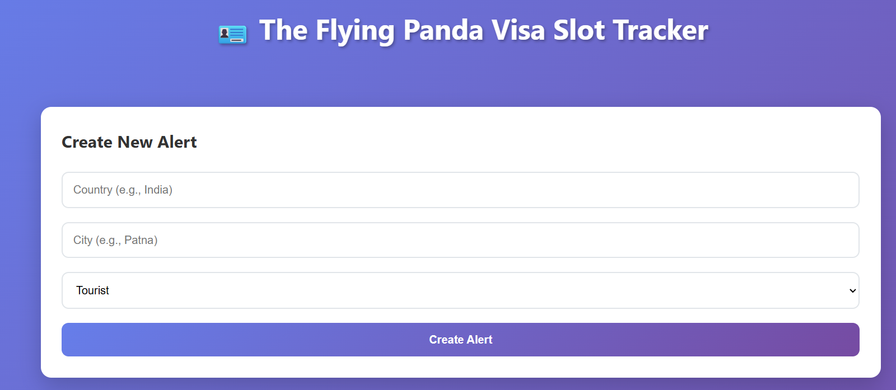
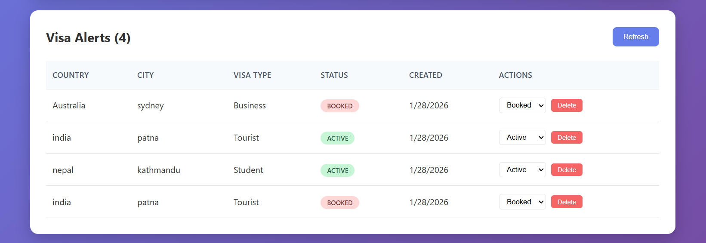

# Visa Track 🎯

A simple and focused full‑stack app to help you track visa appointment alerts by country, city, visa type, and status. Built with React + Vite on the client and Node.js + Express on the server, persisting alerts in a JSON file for easy demo and learning.

---
## 📸Screenshots

## ✨ Features

- Create visa alerts with:
  - Country
  - City
  - Visa type (Tourist / Business / Student / etc.)
  - Status (Active / Booked / etc.)
- View all alerts in a clean, responsive table.
- Filter alerts by:
  - Country
  - Status
- Update alert status (e.g., from Active → Booked).
- Delete alerts you no longer need.
- Simple JSON‑file persistence on the backend (no database required).

---

## 🧰 Tech Stack

| Layer      | Tech                                                                                                   |
|-----------|--------------------------------------------------------------------------------------------------------|
| Frontend  |  React,  Vite,  JavaScript |
| Backend   |  Node.js,  Express |
| Styling   |  CSS / any preferred styling approach |
| Tooling   |  npm,  Git,  GitHub |

> You can freely adjust logos/links if you change technologies later.

---
🚀 Getting Started
Prerequisites
Node.js (LTS recommended)

npm (comes with Node)

Git

Clone the Repository
bash
git clone https://github.com/AkbarMWaris/Visa-Track.git
cd Visa-Track
Backend Setup
bash
cd backend

# Install dependencies
npm install

# Start backend in development
npm run server
# or for production-like run
npm start
By default, the backend runs on:

text
http://localhost:5000
The server exposes REST endpoints under /alerts and stores all data in alerts.json.

Frontend Setup
bash
# From project root
cd client   # or `frontend` depending on your folder name

# Install dependencies
npm install

# Start Vite dev server
npm run dev
Vite will start the app at something like:

text
http://localhost:5173
Make sure the backend is running so the frontend can communicate with it.

🔐 Environment Variables
Create a .env file in your frontend folder (e.g., client/.env or frontend/.env):

text
VITE_API_URL=http://localhost:5000
In production or another environment, you can point this to any deployed backend URL:

text
VITE_API_URL=https://your-backend-domain.com
The frontend uses this variable like:

js
const API_URL = import.meta.env.VITE_API_URL || 'http://localhost:5000';
📜 Available Scripts
Backend (in backend/)
bash
# Install dependencies
npm install

# Run development server with nodemon (auto-restart on file changes)
npm run server

# Run server with plain node
npm start
Frontend (in client/ or frontend/)
bash
# Install dependencies
npm install

# Run Vite dev server
npm run dev

# Build for production
npm run build

# Preview production build locally
npm run preview
📡 API Endpoints
Base URL (local):

text
http://localhost:5000
GET /alerts
Returns the list of all alerts.

Supports optional query parameters (if implemented):

country

status

Example response:

json
[
  {
    "id": "1769575266133",
    "country": "USA",
    "city": "New York",
    "visaType": "Tourist",
    "status": "Active",
    "createdAt": "2026-01-28T04:41:06.134Z"
  }
]
POST /alerts
Creates a new alert.

Request body:

json
{
  "country": "USA",
  "city": "New York",
  "visaType": "Tourist",
  "status": "Active"
}
Response:

json
{
  "id": "generated-id",
  "country": "USA",
  "city": "New York",
  "visaType": "Tourist",
  "status": "Active",
  "createdAt": "2026-01-28T04:41:06.134Z"
}
PUT /alerts/:id
Updates an existing alert (typically status or other fields).

Request body:

json
{
  "country": "USA",
  "city": "New York",
  "visaType": "Tourist",
  "status": "Booked"
}
DELETE /alerts/:id
Deletes an alert by id.

Returns 204 No Content on success (commonly used pattern).

